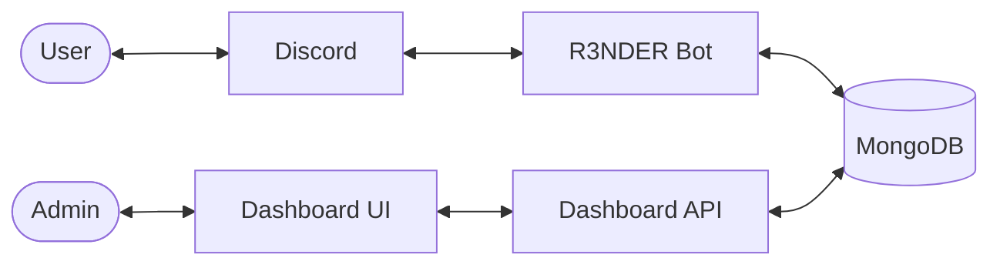

# 🤖 R3NDER

> [!NOTE]
> **R3NDER** is a premium, enterprise-grade Discord platform featuring high-fidelity AI, interactive music, and a sleek web dashboard. Built for communities that demand a superior experience.

---

## 🚀 Overview
R3NDER is a modular ecosystem designed with a Service-Oriented Architecture (SOA). It bridges the gap between Discord-based community interaction and professional web-based server management. By leveraging OpenAI's state-of-the-art models and a robust TypeScript backend, R3NDER provides an unparalleled level of automation and engagement.

## ✨ Features

### 🧠 AI Autopilot
The Autopilot system makes R3NDER feel like a true participant in your server:
- **Smart Mentions**: Respond naturally with 15-message persistent memory (via MongoDB).
- **Auto-Mod**: AI-driven toxicity detection with "Delete -> Warn -> Timeout" escalation.
- **Ice-Breakers**: Automatically re-engages silent channels with unique conversation starters (70% casual, 30% professional).

### 🎵 Music System
Experience music like never before with our interactive player UI:
- **Persistent Player**: A single, dynamic embed that updates in real-time.
- **Rich Controls**: Buttons for Toggle/Pause, Skip, Stop, Loop, Shuffle, and Volume +/-.
- **Fast Search**: Optimized YouTube/Spotify integration via DisTube.

### 💰 Economy System
Drive community engagement with a robust coin-based economy:
- **Daily Rewards**: Claim coins with streak bonuses to encourage daily activity.
- **Dynamic Shop**: Users can buy Roles, XP Boosts, and AI Perks.
- **Type-Safe Balances**: Strictly validated transactions with guild-specific storage.

### 🌐 Dashboard
Manage your server from anywhere with our web interface:
- **Discord OAuth2**: Secure, session-based authentication for server admins.
- **Instant Sync**: Change a setting on the web, and R3NDER's behavior updates on Discord instantly.
- **Glassmorphism UI**: Beautiful, dark-mode design built with React, Vite, and Tailwind CSS.

---

## ⚙️ Setup Guide

### 🛠️ Prerequisites
- **Node.js**: v18.0.0 or higher
- **MongoDB**: Local instance or MongoDB Atlas URI
- **Discord Bot**: A registered application on the [Discord Developer Portal](https://discord.com/developers/applications)

### 🚀 Quick Start (Terminal)
```bash
# 1. Clone the repository
git clone https://github.com/your-repo/r3nder.git
cd r3nder

# 2. Install all dependencies (Monorepo)
npm install
cd dashboard/server && npm install
cd ../client && npm install
cd ../..

# 3. Configure Environment
cp .env.example .env

# 4. Start Development Mode
npm run dev
```

---

## 🔑 Environment Variables
Configure your `.env` file with the following variables:

| Variable | Required | Description |
| :--- | :--- | :--- |
| `TOKEN` | Yes | Your Discord Bot Token |
| `MONGO_URI` | Yes | MongoDB connection string |
| `OPENAI_API_KEY`| Yes | For AI Autopilot and Vision features |
| `CLIENT_ID` | Yes | Discord Application Client ID |
| `CLIENT_SECRET` | Yes | Discord Application Client Secret |
| `CALLBACK_URL` | Yes | `http://localhost:3001/auth/callback` |
| `SESSION_SECRET`| Yes | Secret key for dashboard security |

---

## 🏗️ Architecture Overview
R3NDER uses a **Service-Oriented Architecture (SOA)** ensuring high modularity and scalability:
- **Core Bot**: Handles Discord interactions, music events, and economy logic.
- **API Server**: An Express.js backend for the web dashboard and Discord OAuth2.
- **React Frontend**: A Vite-powered SPA for server configuration.
- **Shared Layer**: TypeScript interfaces shared between the dashboard and bot for strict type safety.



---

## 🛠️ Troubleshooting

### ❌ TypeScript Errors
Ensure you are running the unified check to validate all modules:
```bash
npm run tsc:check
```

### ❌ Database Connection Issues
- Verify your `MONGO_URI` is correct in the `.env` file.
- **Special Characters**: If your password contains characters like `@`, `#`, `:`, or `/`, you **must URL-encode them** (e.g., `pass@word` -> `pass%40word`).
- Ensure your MongoDB instance is running or your IP is whitelisted on Atlas.

### ❌ Discord OAuth2 Failure
- Double-check your `CALLBACK_URL` in the [Discord Developer Portal](https://discord.com/developers/applications).
- Ensure it matches the `CALLBACK_URL` in your `.env` exactly.

### ❌ Dashboard UI Not Loading
- Ensure `npm run dev` is running, which starts the client on port `3000`.
- Check the browser console for any API connectivity errors.

---

## 💎 Premium Vision
R3NDER can "see" through GPT-4o. Use `/analyze` to extract text, describe images, or generate artistic captions.
